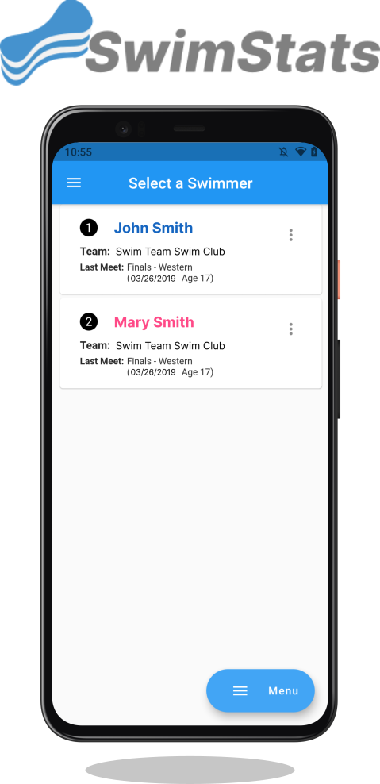

#

**SwimStats** is a free, open source mobile app for displaying swimming results of age group swimmers currently registered under <a href ="https://www.usaswimming.org/"> USA Swimming </a>.

Various swimmer data, including personal best times, time standards, and time comparisons can all all be accesed through this application.

The application is available for Android and iOS, while a web application is currently in development and will
be made avaliable later on.

# Installation

There are applications avaliable for **mobile** (Android and iOS). Both the iOS and Android applications have similar user interfaces.

## Mobile Applications

| Operating System | Download                                                                                   |
| ---------------- | ------------------------------------------------------------------------------------------ |
| Android          |  |
| Android Alt.     |  |
| iOS              |    |

# Credits
All swimmer information is collected from swimmingrank.com. Thank you to the **WC Lee** of Swimming Rank for maintaining a providing a public database for everyone to use. If you have any inquiries regarding how swimmer data is handled, please contact swimmingrank@gmail.com or <a href="https://www.swimmingrank.com/privacy_policy.html"> read their privacy policy</a>.

Thank you to **Niko Parastaev** for providing invaluable designs for SwimStats.

# Contact Us

If you have any questions, please visit our <a href ="https://swimstatsapp.github.io/">website </a> or email us at swimstatsapp@gmail.com.
